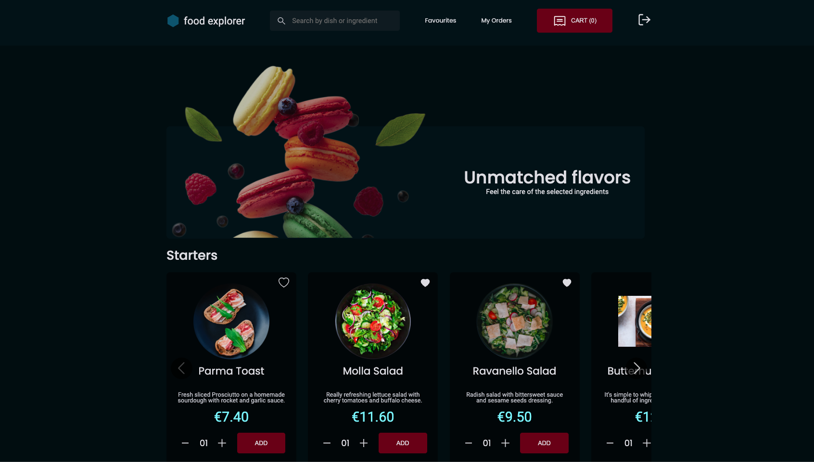
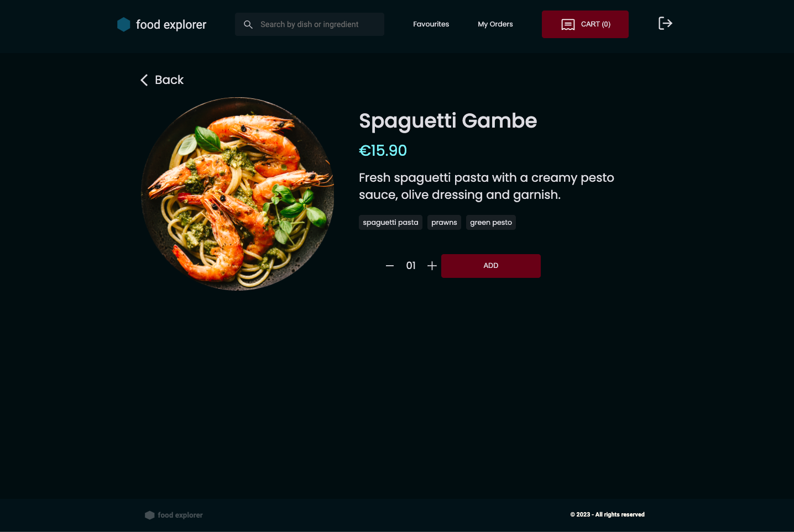
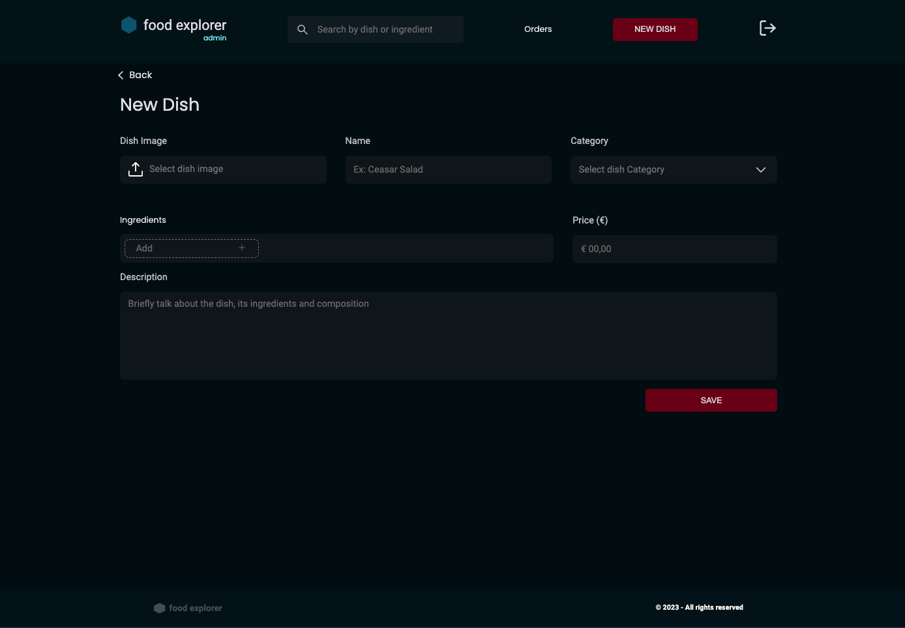
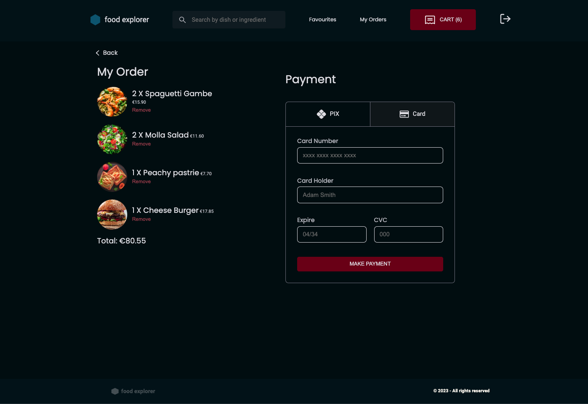
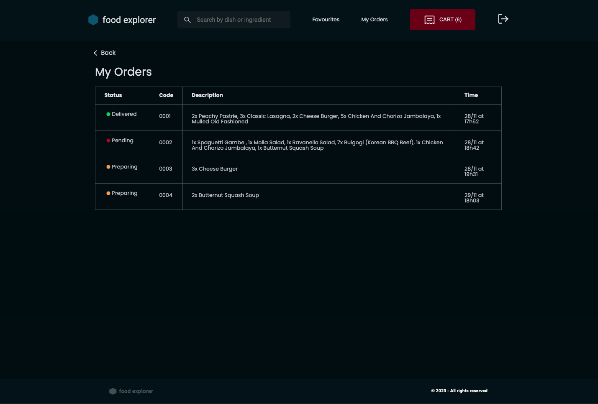

# Food Explorer - CRUD Restaurant App

This is the Final Project of the Explorer Module - RocketSeat Programming School

Welcome to **Food Explorer**, a CRUD application of a restaurant menu that allows users to view, navigate and place orders. The project is divided into two main components: a backend API developed with Node.js, Express, and SQLite, and a frontend built with React.js and Styled Components.

## Table of Contents

- [Introduction](#introduction)
- [Features](#features)
- [Technologies Used](#technologies-used)
- [Setup Instructions](#setup-instructions)
- [Usage](#usage)
- [Screenshots](#screenshots)
- [License](#license)
- [API Repository](#api-repository)

## Introduction

Welcome to **Food Explorer**, your go-to online platform for exploring and managing a restaurant's menu. This application provides a seamless experience for both regular users and administrators, allowing common users to browse and navigate through a variety of dishes, add items to their orders, and complete transactions. Administrators, on the other hand, have the power to create new dishes, delete existing ones, and efficiently manage the menu.

## Features

- Create, Read, Update, and Delete information about restaurant dishes.
- Seamless integration between the backend API and the frontend UI.

## Technologies Used

- **Backend**:
  - Node.js: JavaScript runtime environment.
  - Express: Web application framework for Node.js.
  - SQLite: Embedded database.

- **Frontend**:
  - React.js: JavaScript library for building user interfaces.
  - Styled Components: CSS-in-JS library for component styling.
 
## Deploy
https://thefoodexplorer.netlify.app

This application is hosted on a free service, and as a result, it may experience occasional slowness. We appreciate your understanding and patience.

## Setup Instructions
 
1. **Clone the FrontEnd Repository**:
   ```bash
   git clone https://github.com/eduaardofranco/foodExplorer.git
   cd foodExplorer
   ```
2. **Clone the BackEnd Repository**:
   ```bash
   git clone https://github.com/eduaardofranco/foodExplorerApi.git
   cd foodExplorerApi
   ```

3. **Install Backend**:
   ```bash
   cd foodExplorerApi
   npm install
   ```

4. **Install Frontend**:
   ```bash
   cd frontend
   npm install
   ```

5. **Run the Application**:
   ```bash
   # Start the backend server (from the backend directory)
   npm run dev

   # Start the frontend development server
   npm run dev
   ```

6. **Access the Application**:
   - The backend server will be available at `http://localhost:3333`
   - The frontend development server will be available at `http://localhost:3000`

## Usage

### User
   - Create new account with email and password
   - login with credentials on login's page

### Admin
   - User Admin: admin@admin.com<br>
   - Password: UserAdminExplorer</br>

1. Access the frontend application in your web browser.
2. Use the interface to perform CRUD operations on restaurant dish information.

## Screenshots



### Dish Details Page



### Add New Dish Page



### Cart Page



### Orders Page



## License

This project is licensed under the [MIT License](LICENSE).

## API Repository

The source code for the API can be found at [Food Explorer API](https://github.com/eduaardofranco/foodExplorerApi).